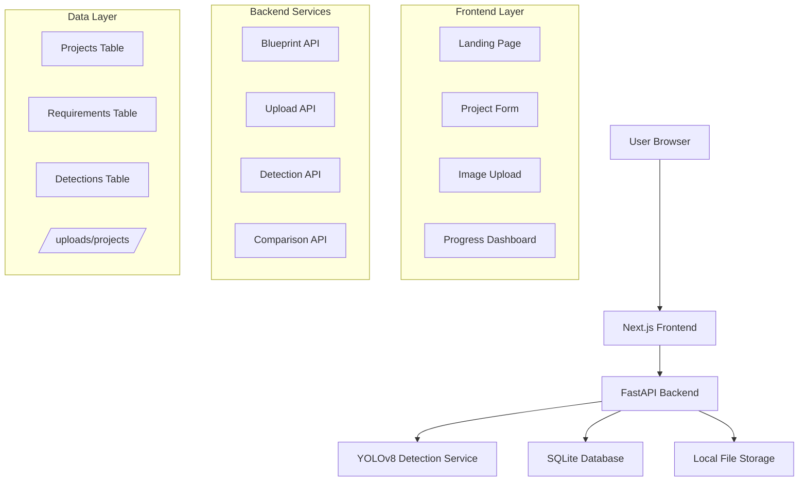

# Design Document

## Overview

SyteScan Progress Analyzer is a web-based platform that combines modern frontend technologies with AI-powered backend services to provide construction progress tracking. The system uses Next.js for the frontend, FastAPI for the backend, YOLOv8 for object detection, and SQLite for data persistence. The architecture is designed to be lightweight for prototyping while maintaining scalability for future enhancements.

## Architecture

### High-Level Architecture



### Technology Stack

**Frontend:**
- Next.js 14 with TypeScript for type safety and SSR capabilities
- TailwindCSS for utility-first styling with custom royal cream theme
- Recharts for data visualization and progress charts
- React Hook Form for form management and validation

**Backend:**
- FastAPI with Python 3.11+ for async API development
- Ultralytics YOLOv8n (nano model) for lightweight CPU-based object detection
- SQLAlchemy ORM for database operations
- Pydantic for request/response validation

**Data Storage:**
- SQLite for relational data (projects, requirements, detections)
- Local filesystem for image storage with organized directory structure

## Components and Interfaces

### Frontend Components

#### 1. Landing Page Component
```typescript
interface LandingPageProps {
  modules: ModuleInfo[];
}

interface ModuleInfo {
  id: string;
  name: string;
  status: 'active' | 'coming-soon';
  description: string;
  route: string;
}
```

#### 2. Project Form Component
```typescript
interface ProjectFormProps {
  onSubmit: (data: ProjectData) => Promise<void>;
}

interface ProjectData {
  name: string;
  requirements: string[];
}
```

#### 3. Image Upload Component
```typescript
interface ImageUploadProps {
  projectId: string;
  maxFiles: number;
  onUploadComplete: (results: DetectionResult[]) => void;
}

interface DetectionResult {
  imageId: string;
  detectedObjects: DetectedObject[];
  processingTime: number;
}
```

#### 4. Progress Dashboard Component
```typescript
interface DashboardProps {
  projectId: string;
}

interface ProgressData {
  completionPercentage: number;
  requirements: RequirementStatus[];
  detectionSummary: DetectionSummary;
}
```

### Backend API Interfaces

#### 1. Blueprint Management API
```python
# POST /api/projects
class ProjectCreateRequest(BaseModel):
    name: str
    requirements: List[str]

class ProjectResponse(BaseModel):
    id: str
    name: str
    requirements: List[str]
    created_at: datetime
```

#### 2. Image Upload API
```python
# POST /api/projects/{project_id}/upload
class UploadResponse(BaseModel):
    uploaded_files: List[str]
    detection_results: List[DetectionResult]

class DetectionResult(BaseModel):
    image_path: str
    detected_objects: List[DetectedObject]
    confidence_scores: Dict[str, float]
```

#### 3. Progress Comparison API
```python
# GET /api/projects/{project_id}/progress
class ProgressResponse(BaseModel):
    project_id: str
    completion_percentage: float
    requirement_matches: List[RequirementMatch]
    detection_summary: DetectionSummary
```

## Data Models

### Database Schema

```sql
-- Projects table
CREATE TABLE projects (
    id TEXT PRIMARY KEY,
    name TEXT NOT NULL,
    created_at TIMESTAMP DEFAULT CURRENT_TIMESTAMP,
    updated_at TIMESTAMP DEFAULT CURRENT_TIMESTAMP
);

-- Requirements table
CREATE TABLE requirements (
    id TEXT PRIMARY KEY,
    project_id TEXT NOT NULL,
    object_name TEXT NOT NULL,
    created_at TIMESTAMP DEFAULT CURRENT_TIMESTAMP,
    FOREIGN KEY (project_id) REFERENCES projects (id)
);

-- Detections table
CREATE TABLE detections (
    id TEXT PRIMARY KEY,
    project_id TEXT NOT NULL,
    image_path TEXT NOT NULL,
    object_name TEXT NOT NULL,
    confidence REAL NOT NULL,
    bbox_x REAL,
    bbox_y REAL,
    bbox_width REAL,
    bbox_height REAL,
    created_at TIMESTAMP DEFAULT CURRENT_TIMESTAMP,
    FOREIGN KEY (project_id) REFERENCES projects (id)
);
```

### File Storage Structure

```
uploads/
└── projects/
    └── {project_id}/
        ├── images/
        │   ├── original/
        │   │   ├── image_1.jpg
        │   │   └── image_2.jpg
        │   └── processed/
        │       ├── image_1_annotated.jpg
        │       └── image_2_annotated.jpg
        └── metadata.json
```

## Core Services

### 1. Object Detection Service

```python
class DetectionService:
    def __init__(self):
        self.model = YOLO('yolov8n.pt')  # Lightweight nano model
        
    async def detect_objects(self, image_path: str) -> List[DetectedObject]:
        """Process image and return detected objects with confidence scores"""
        
    def filter_relevant_objects(self, detections: List, requirements: List[str]) -> List[DetectedObject]:
        """Filter detections to only include objects from requirements list"""
```

### 2. Progress Comparison Service

```python
class ComparisonService:
    def calculate_progress(self, requirements: List[str], detections: List[DetectedObject]) -> ProgressResult:
        """Compare requirements against detections and calculate completion percentage"""
        
    def generate_requirement_matches(self, requirements: List[str], detections: List[DetectedObject]) -> List[RequirementMatch]:
        """Create detailed matching results for dashboard display"""
```

### 3. Database Service

```python
class DatabaseService:
    async def create_project(self, project_data: ProjectCreateRequest) -> Project:
        """Create new project with requirements"""
        
    async def store_detections(self, project_id: str, detections: List[DetectedObject]) -> None:
        """Store detection results in database"""
        
    async def get_project_progress(self, project_id: str) -> ProgressData:
        """Retrieve complete progress data for dashboard"""
```

## Error Handling

### Frontend Error Handling
- Form validation with real-time feedback
- File upload error handling with retry mechanisms
- Loading states and progress indicators
- Graceful degradation for API failures

### Backend Error Handling
- Custom exception classes for different error types
- Structured error responses with appropriate HTTP status codes
- Logging for debugging and monitoring
- Input validation with Pydantic models

```python
class SyteScanException(Exception):
    """Base exception for SyteScan application"""
    
class DetectionError(SyteScanException):
    """Raised when object detection fails"""
    
class ValidationError(SyteScanException):
    """Raised when input validation fails"""
```

## Testing Strategy

### Frontend Testing
- Unit tests for utility functions and hooks using Jest
- Component testing with React Testing Library
- Integration tests for complete user workflows
- Visual regression testing for UI consistency

### Backend Testing
- Unit tests for service classes and utility functions using pytest
- API endpoint testing with FastAPI TestClient
- Database integration tests with test database
- Object detection service testing with sample images

### End-to-End Testing
- Complete user workflow testing from project creation to dashboard
- Cross-browser compatibility testing
- Performance testing for image processing workflows
- Error scenario testing (network failures, invalid inputs)

## Performance Considerations

### Frontend Optimization
- Next.js SSR for faster initial page loads
- Image optimization and lazy loading
- Component code splitting and dynamic imports
- Efficient state management with React hooks

### Backend Optimization
- Async/await patterns for non-blocking operations
- Image processing optimization with proper memory management
- Database query optimization with proper indexing
- Caching strategies for frequently accessed data

### YOLOv8 Optimization
- Use nano model (yolov8n.pt) for faster CPU inference
- Batch processing for multiple images when possible
- Image preprocessing optimization (resize, normalize)
- Memory management for large image processing

## Security Considerations

### Input Validation
- File type and size validation for uploads
- SQL injection prevention with parameterized queries
- XSS prevention with proper input sanitization
- CSRF protection for form submissions

### File Security
- Secure file upload handling with virus scanning consideration
- Proper file permissions for upload directories
- File type validation beyond extension checking
- Storage quota management to prevent disk space abuse

## Deployment Architecture

### Development Environment
- Docker Compose for local development
- Hot reloading for both frontend and backend
- Shared volumes for file storage
- Environment variable management

### Production Considerations
- Containerized deployment with Docker
- Reverse proxy configuration (nginx)
- SSL/TLS termination
- Log aggregation and monitoring
- Backup strategies for SQLite database and uploaded files